# 搭建教程

## 前期准备

### 安装Node.js

前往[官网](https://nodejs.org/en/download)下载，选择合适的版本，按照默认安装即可。

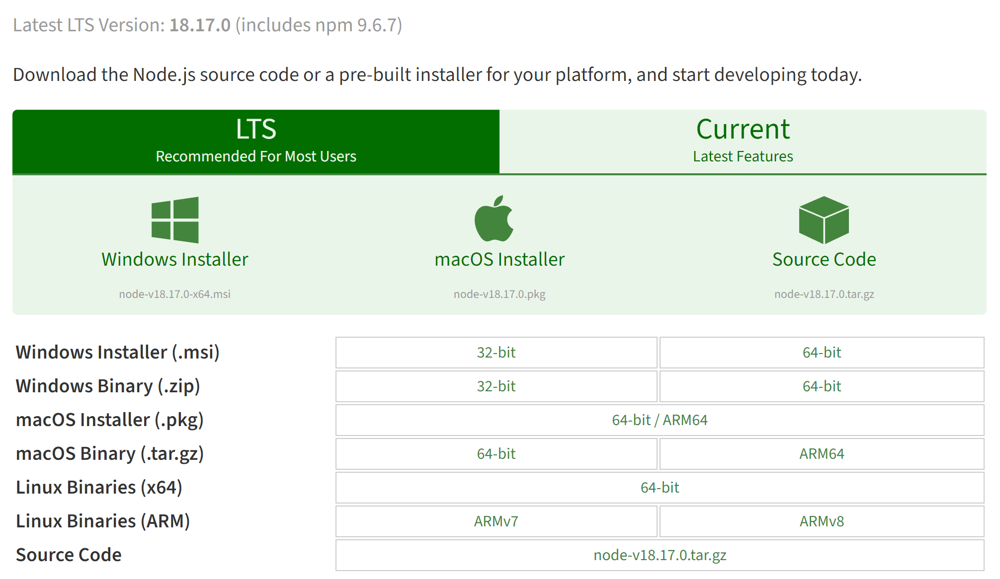

### 安装Git

前往[官网](https://git-scm.com/download/win)下载，选择合适的版本，按照默认安装即可。

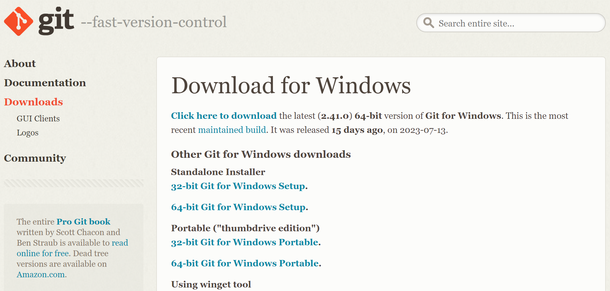

### 检验软件是否安装成功

同时按下 Win + R 键打开运行窗口，输入 cmd ，然后输入以下命令，有相应版本信息显示则安装成功，若不正确可以卸载软件重新安装。

```
$ git --version
$ $node -v
$ npm -v
```

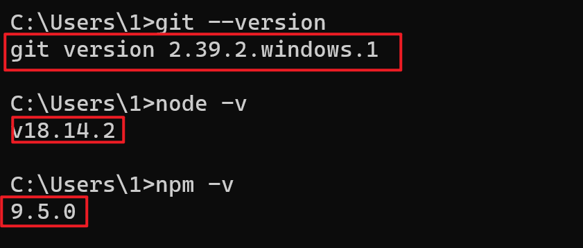

此外，若Git安装成功，则在鼠标右键菜单中会出现Git GUI Here 和 Git Bash Here两个选项。其中，Git GUI Here 是图形界面的Git操作，Git Bash Here 命令行终端。

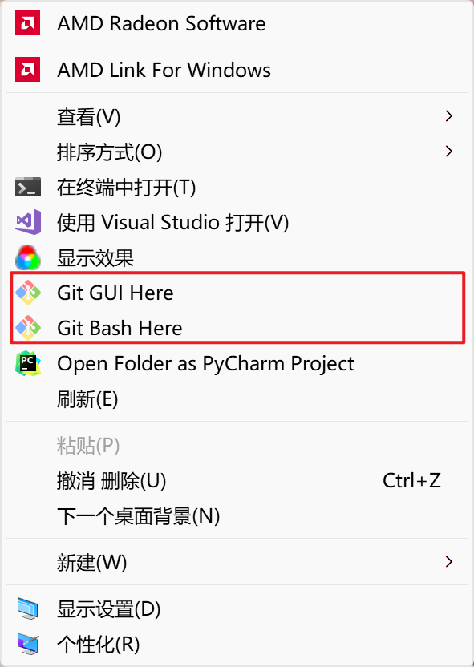

## 开始搭建

### 安装Hexo

选择一个新建的文件夹，右键点击 Git Bash Here 打开命令行终端。输入以下命令即可安装Hexo，第一个命令表示安装 hexo，第二个命令表示安装 hexo 部署到 git page 的 deployer，如图所示即为安装成功。

```
$ npm install hexo-cli -g
$ npm install hexo-deployer-git -S
```

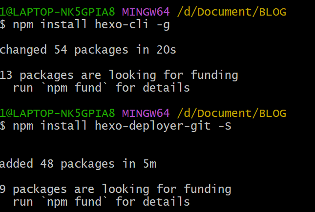

### 初始化Hexo配置

在刚才新建的文件夹里面再次新建一个 Hexo 文件夹，进入该 Hexo 文件夹右键鼠标，点击 Git Bash Here，输入以下命令，如图所示则安装成功

```
$ hexo init
```

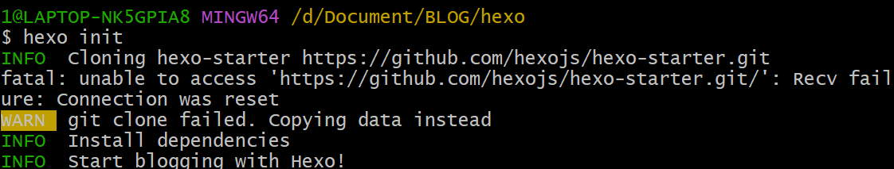

Hexo 安装完成后，将会在指定文件夹中新建所需要的文件，Hexo 文件夹下的目录如下：

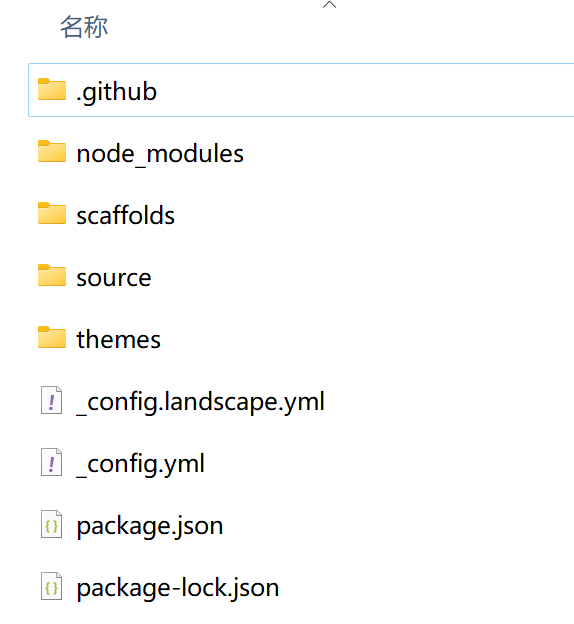

### 本地查看效果

运行以下命令即可登录[localhost:4000/](http://localhost:4000/ )查看效果

```
$ hexo g
$ hexo s
```

显示如下信息表示操作成功。

```
INFO Hexo is running at http://0.0.0.0:4000/. Press Ctrl+C to stop.
```

登录[localhost:4000/](http://localhost:4000/ )查看效果：

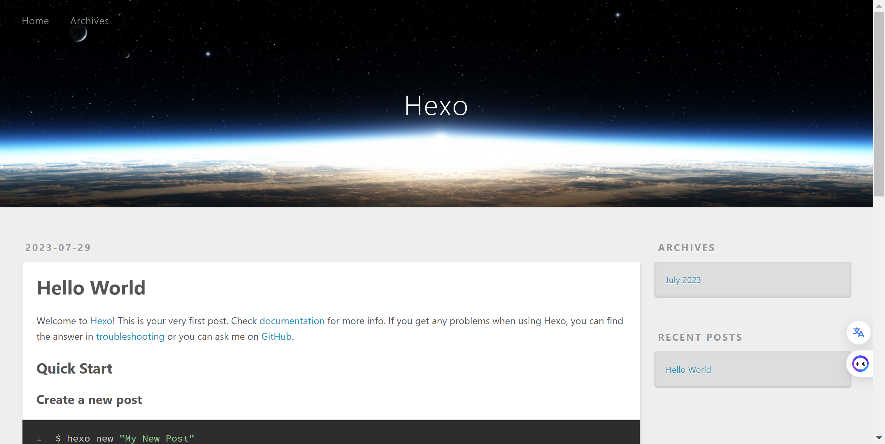

## 部署至Github Pages

到目前为止，我们的本地博客就成功搭建了，但是现在我们只能通过本地连接查看博客，我们要做的是让其他人也能够访问我们的博客，这就需要我们将博客部署到 Github Pages 上。

### 注册 Github 账户

访问[Github](https://github.com/)官网，点击Sign Up注册账户。

### 创建 Github Pages 仓库

点击 New repository 开始创建，步骤如下图：

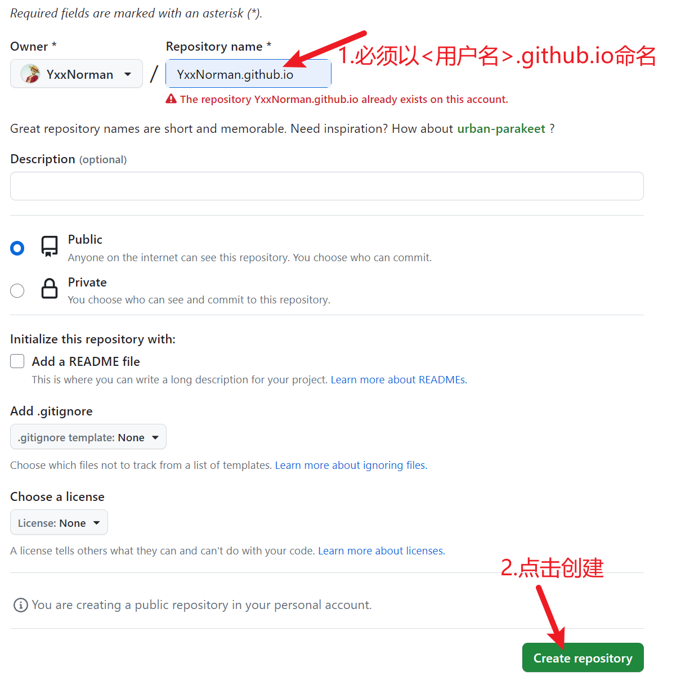

### 配置SSH密钥

 只有配置好 SSH 密钥后，我们才可以通过 git 操作实现本地代码库与 Github 代码库同步。
 #### 1. 创建SSH密钥
 在第一次新建的文件夹里面 Git Bash Here 输入以下命令：

```
$ ssh-keygen -t rsa -C "email@example.com"
//引号里面填写自己的邮箱地址
```

之后会出现：

```
Generating public/private rsa key pair.
Enter file in which to save the key (/c/Users/you/.ssh/id_rsa):
//到这里可以直接回车将密钥按默认文件进行存储
```

然后会出现：

```
Enter passphrase (empty for no passphrase):
//这里是要你输入密码，其实不需要输什么密码，直接回车就行
Enter same passphrase again:
```

接下来会显示：

```
Your identification has been saved in /c/Users/you/.ssh/id_rsa.
Your public key has been saved in /c/Users/you/.ssh/id_rsa.pub.
The key fingerprint is:
这里是各种字母数字组成的字符串，结尾是你的邮箱
The key's randomart image is:
这里也是各种字母数字符号组成的字符串
```

运行以下命令，将公钥的内容复制到系统粘贴板上：

```
$ clip < ~/.ssh/id_rsa.pub
```

 #### 2. 在Github账户添加自己的公钥

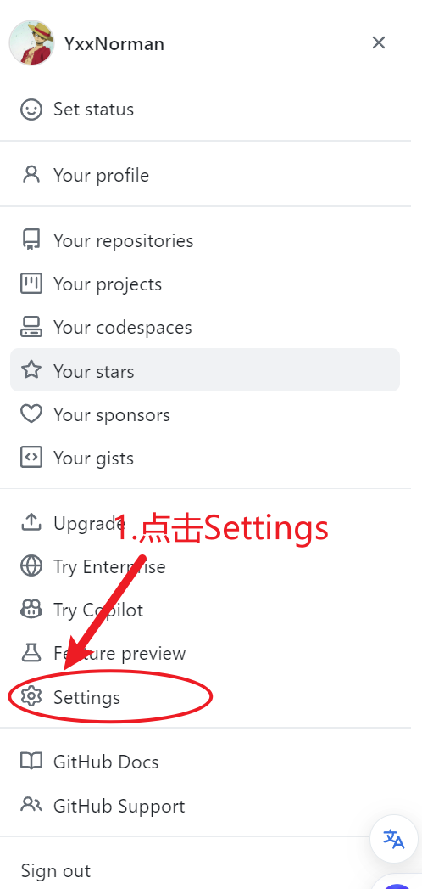
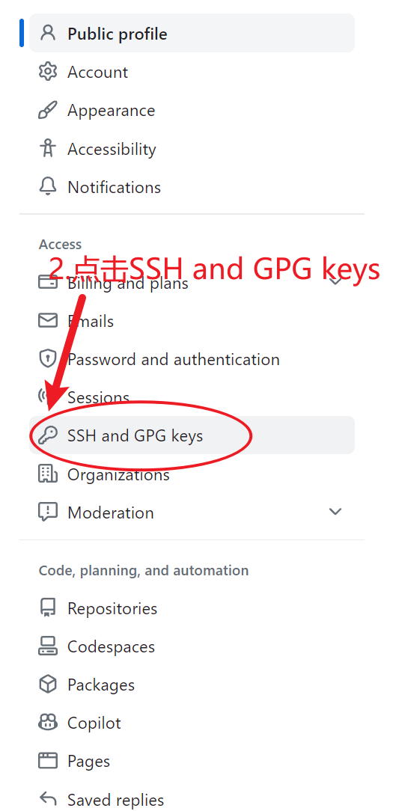
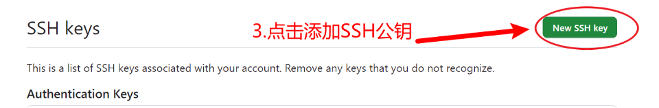
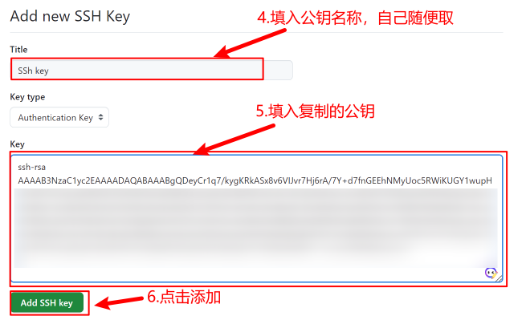

#### 3. 测试公钥

输入以下命令，注意: git@github.com不要做任何更改！

```text
$ ssh -T git@github.com
```

出现如下图所示信息，则表示配置成功！

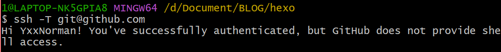

### 配置Git个人信息

Git 会根据用户的名字和邮箱来记录提交，GitHub 也是用这些信息来做权限的处理，输入以下命令进行个人信息的设置，把名称和邮箱替换成自己的。

```
$ git config --global user.name "此处填你的用户名"
$ git config --global user.email "此处填你的邮箱"
```

到此为止 SSH Key 配置成功，本机已成功连接到 Github

### 将本地文件更新到Github库中

1. 打开自己创建的仓库<ins>yourname.github.io</ins>
2. 复制SSH地址
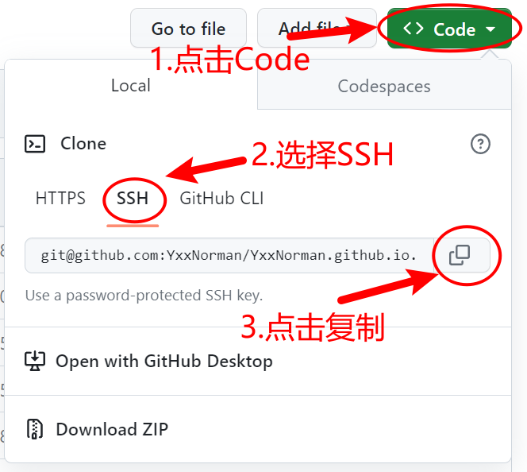
3. 修改配置文件：打开你创建的 Hexo 文件夹，右键用记事本打开该文件夹下的 *_config.yml*文件，找到Deployment代码部分，按照如下代码修改配置文件。

```yml
# Deployment
## Docs: https://hexo.io/docs/one-command-deployment
deploy:
  type: git
  repository: git@github.com:YxxNorman/YxxNorman.github.io.git    # 刚刚复制的SSH地址
  branch: master
```

4. 部署博客：运行以下命令，博客就会部署到Github上了。

```
$ hexo g
$ hexo d
```

或者

```
$ hexo g -d
```

5. 查看博客：你的博客地址：<ins>https://你的用户名.github.io</ins>。现在每个人都可以通过此链接访问你的博客了。